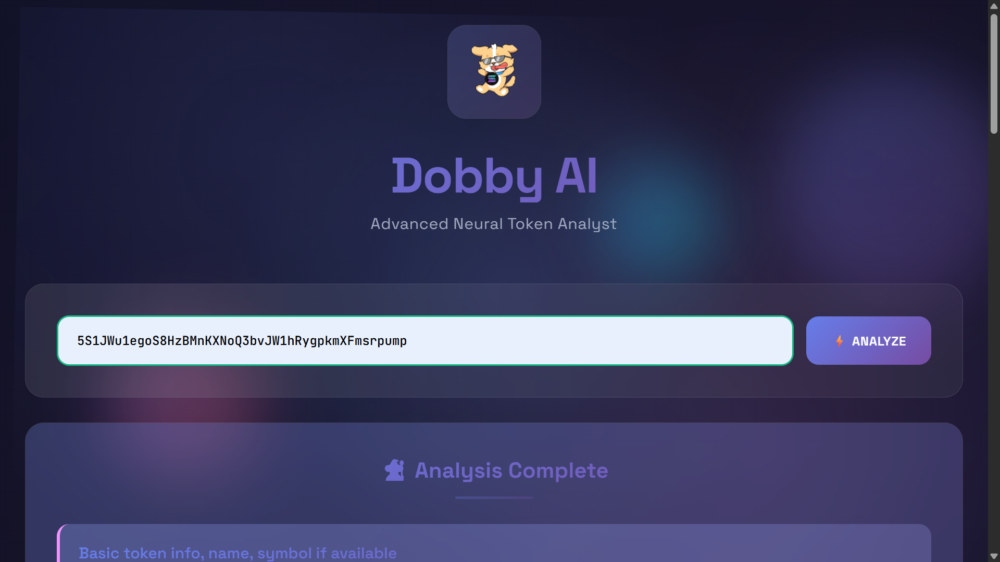
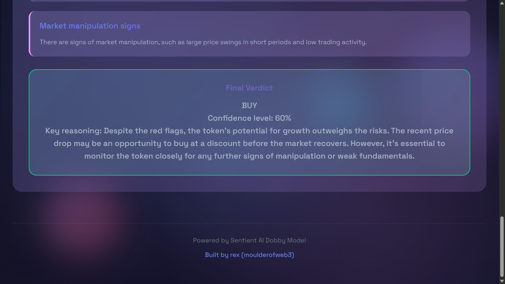

# Dobby AI - Advanced Solana Token Analyzer

A sleek, real-time token analysis tool that leverages neural networks to provide comprehensive investment insights for Solana tokens. Built with modern web technologies and powered by the Sentient AI Dobby model.




## ✨ Features

- **Real-time Analysis** - Instant token evaluation using DexScreener API data
- **Neural Network Powered** - Advanced pattern recognition via Sentient AI Dobby model
- **Comprehensive Reports** - 6-section detailed analysis covering all critical aspects
- **Modern UI/UX** - Glassmorphism design with smooth animations and responsive layout
- **Smart Formatting** - Clean, readable output with intelligent text processing
- **Debug Console** - Built-in logging system for troubleshooting
- **Mobile Optimized** - Works seamlessly across all devices

## 🚀 Live Demo

Try it out: [Your Demo URL Here]

## 📋 Analysis Sections

Each token analysis includes:

1. **Token Overview** - Basic info, price, and market cap
2. **Liquidity Analysis** - Pool depth and DEX distribution  
3. **Trading Volume & Activity** - Volume patterns and market participation
4. **Price Performance** - Recent movements and volatility metrics
5. **Red Flags & Risks** - Potential concerns and warning signs
6. **Final Verdict** - Clear BUY/HOLD/AVOID recommendation

## 🛠️ Tech Stack

- **Frontend**: Vanilla HTML, CSS, JavaScript
- **Styling**: Custom CSS with glassmorphism effects
- **Fonts**: Space Grotesk, JetBrains Mono
- **API**: DexScreener (token data), Fireworks AI (analysis)
- **Model**: Sentient Foundation Dobby Mini Unhinged Plus (Llama 3.1 8B)

## 📦 Installation

1. Clone the repository:
```bash
git clone https://github.com/yourusername/dobby-ai-token-analyzer.git
cd dobby-ai-token-analyzer
```

2. Set up your API key:
   - Get your Fireworks AI API key from [fireworks.ai](https://fireworks.ai)
   - Replace `DOBBY_KEY` in the script with your key

3. Serve the files:
```bash
# Using Python
python -m http.server 8000

# Or using Node.js
npx serve .

# Or just open index.html in your browser
```

## ⚙️ Configuration

### API Key Setup
Replace the API key in the script:
```javascript
const DOBBY_KEY = "your_fireworks_ai_api_key_here";
```

### Model Parameters
You can adjust the AI model parameters in the `analyze()` function:
```javascript
{
  model: "accounts/sentientfoundation-serverless/models/dobby-mini-unhinged-plus-llama-3-1-8b",
  max_tokens: 1400,
  temperature: 0.3,
  top_p: 0.8,
  // ... other parameters
}
```

## 🎨 Customization

### Colors & Themes
Main color variables are defined in CSS:
```css
:root {
  --primary-gradient: linear-gradient(135deg, #667eea 0%, #764ba2 100%);
  --secondary-gradient: linear-gradient(135deg, #f093fb 0%, #f5576c 100%);
  --accent-gradient: linear-gradient(135deg, #4facfe 0%, #00f2fe 100%);
  /* ... */
}
```

### Animation Settings
Floating orbs and background animations can be modified:
```css
@keyframes meshMove {
  0% { transform: translate(-20px, -20px) rotate(0deg); }
  100% { transform: translate(20px, 20px) rotate(1deg); }
}
```

## 📖 Usage

1. Enter a valid Solana token address (44 characters, base58 encoded)
2. Click "⚡ ANALYZE" or press Enter
3. Wait for the analysis to complete
4. Review the comprehensive 6-section report
5. Use the verdict to inform your investment decisions

### Example Token Addresses
- USDC: `EPjFWdd5AufqSSqeM2qN1xzybapC8G4wEGGkZwyTDt1v`
- SOL: `So11111111111111111111111111111111111111112`
- BONK: `DezXAZ8z7PnrnRJjz3wXBoRgixCa6xjnB7YaB1pPB263`

## 🔍 How It Works

1. **Data Collection**: Fetches real-time token data from DexScreener API
2. **Neural Processing**: Sends structured data to Dobby AI model
3. **Pattern Recognition**: AI analyzes liquidity, volume, price patterns
4. **Risk Assessment**: Identifies red flags and potential concerns  
5. **Verdict Generation**: Provides clear investment recommendation
6. **Format & Display**: Renders clean, readable analysis with proper styling

## 🐛 Troubleshooting

### Common Issues

**Analysis not loading?**
- Check your internet connection
- Verify API key is valid
- Check browser console for errors

**Token not found?**
- Ensure the address is exactly 44 characters
- Verify it's a valid Solana token address
- Try a different token with known trading activity

**API Rate Limits?**
- DexScreener: No documented limits for basic usage
- Fireworks AI: Check your account limits

### Debug Mode
Enable debug logging by opening browser console. All API calls and responses are logged for troubleshooting.

## 🚨 Disclaimer

This tool is for educational and research purposes only. Token analysis and investment recommendations should not be considered financial advice. Always do your own research and consider multiple sources before making investment decisions.

- Past performance doesn't guarantee future results
- Cryptocurrency investments are high-risk
- Market conditions can change rapidly
- AI predictions may not be accurate

## 📄 License

MIT License - feel free to use, modify, and distribute as needed.

## 🤝 Contributing

Contributions are welcome! Please feel free to submit issues, feature requests, or pull requests.

### Development Setup
1. Fork the repository
2. Create a feature branch
3. Make your changes
4. Test thoroughly
5. Submit a pull request

## 📞 Support

- Create an issue for bugs or feature requests
- Follow [@moulderofweb3](https://twitter.com/moulderofweb3) for updates

## 🌟 Roadmap

- [ ] Multi-token comparison feature
- [ ] Historical analysis charts
- [ ] Portfolio tracking integration
- [ ] Alert system for price changes
- [ ] Additional AI models support
- [ ] Dark/light theme toggle
- [ ] Export analysis reports

---

Built with ❤️ by [rex](https://twitter.com/moulderofweb3) using Sentient AI technology.
